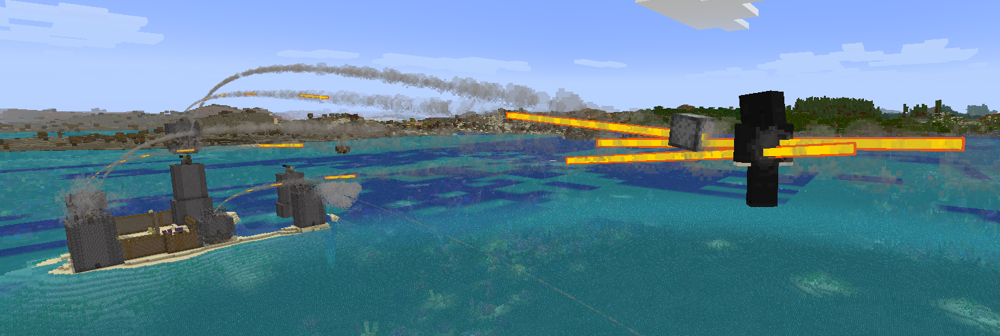
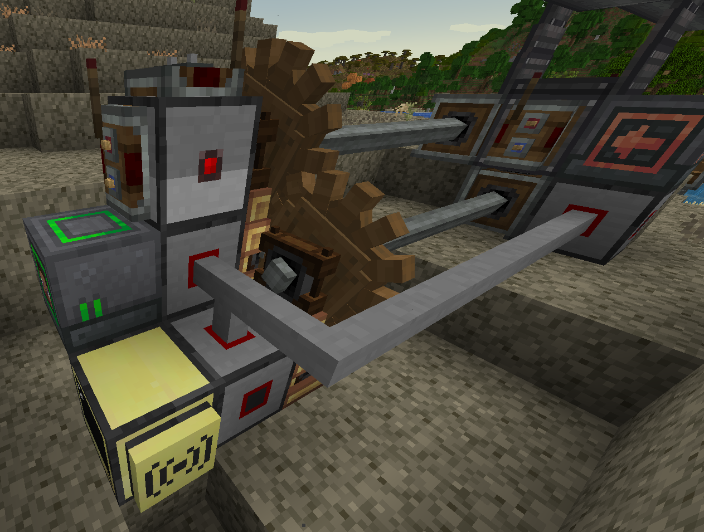
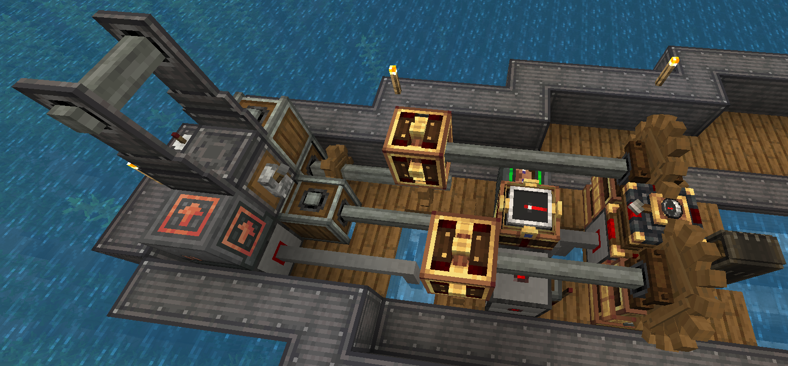
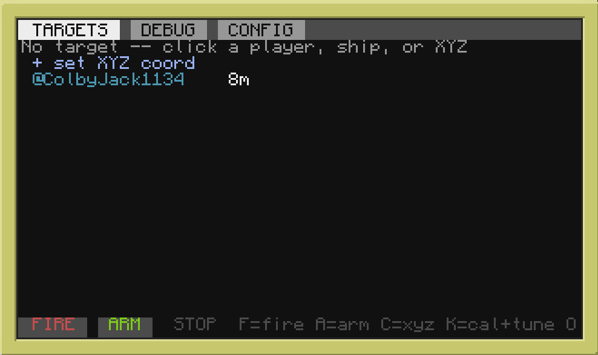
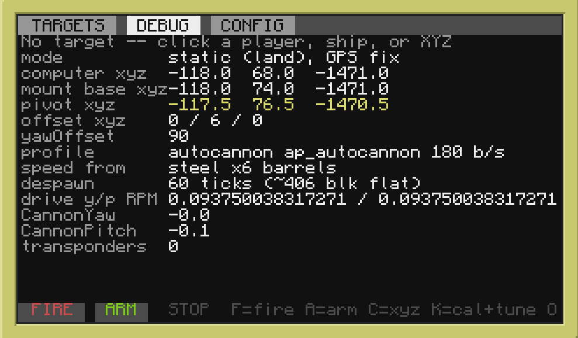

# CCTurret

Auto-aiming turret control for [Create Big Cannons](https://modrinth.com/mod/create-big-cannons) on [CC:Tweaked](https://tweaked.cc/) with [Advanced Peripherals](https://docs.advanced-peripherals.de/). Mount it on the ground or on a [Create Aeronautics](https://github.com/Sciecode/create-aeronautics) airship; it tracks players (and ships running [CCMinimap](https://github.com/ColbyJack1134/CCMinimap) or with a transponder), solves the ballistic arc (gravity and drag), and leads moving targets. One-line install with self-calibrating drives, running fully in ComputerCraft with no server required. Optional [Spruce](https://github.com/ColbyJack1134/Spruce) integration for remote command and control.



## Requirements

Mods:

- [CC:Tweaked](https://tweaked.cc/)
- [Create](https://modrinth.com/mod/create)
- [Create Big Cannons](https://modrinth.com/mod/create-big-cannons)
- [Advanced Peripherals](https://docs.advanced-peripherals.de/) — Block Reader and Player Detector

In-game:

- Advanced Computer
- **2x Rotation Speed Controller** to control the mount's yaw and pitch
- **Block Reader** against the cannon mount to read `CannonYaw` / `CannonPitch`
- **Player Detector**
- **Redstone Relay** for fire, assemble, and reload signals
- Wireless modem + [GPS constellation](https://tweaked.cc/guide/gps_setup.html) (optional GPS positioning. Required for ship mode and transponder ship targets)
- Navigation table with a compass (required for ship mode to get yaw)
- Gimbal sensor (required for ship mode to get pitch and roll)

## Building the turret

The turret requires an Advanced Computer wired to a handful of peripherals.

### Static mount



A static ground turret requires at least 5 peripherals:
1. Two **Rotation Speed Controllers**. The output of one should connect to the bottom of the turret mount to control yaw, and the output of the other should connect to one of the sides of the turret mount to control pitch. You do not need to know which is which as the turret will auto calibrate.
2. A **Block Reader** pointing directly at the turret mount. The ideal spot is on the side that you did not use for pitch control.
3. A **Player Detector** to get player targets.
4. A **Redstone Relay** to send the redstone signals for fire, assemble, and reload.

The back of the cannon mount also requires a redstone signal to assemble. For autocannons, you can use a lever, but for big cannons you will want a redstone link.

The front of the cannon mount requires a redstone link to control when to fire. By default this signal comes from the top of the Redstone Relay.

A **wireless modem** connected to a [GPS constellation](https://tweaked.cc/guide/gps_setup.html) is optional but worth adding. With it, the computer can locate its own mount
(`cannon.gps = true`) instead of you hand-typing coordinates. But you still need to set the offset from the computer to the mount. Without it, the turret cannot pick up transponder signals either.

### On an airship



Mounted on a [Create Aeronautics](https://github.com/Sciecode/create-aeronautics)
ship, the turret has to know where it is and how the deck is tilted on every
tick. That takes three more peripherals on top of the static set.

The wireless modem with a GPS constellation is required for ship turrets.

A **navigation table** with a compass gives ship heading. The raw needle is
usually rotated from true, so set `ship.headingOffset` to correct it by a multiple of 90°. You can use the `heading` readout on the DEBUG tab to figure out the offset.

A **gimbal sensor** gives deck pitch and roll. `ship.gimbalMap` says which
sensor axis is pitch and which is roll (`x` / `z` by default); `pitchRest` /
`rollRest` are whatever the sensor reads when the ship is dead level. `invertPitch` / `invertRoll` are also options if those values are backwards. The DEBUG tab shows live `ship pitch` and `ship roll` for figuring out these values. By convention pitch is +nose-up
and roll is +right-side-down.

Turn it all on with `ship.enabled = true` (in `cannon.cfg`, or the CONFIG tab's
Ship group). If GPS or the nav table ever go quiet the turret holds and shows
`NO FIX` rather than firing on a stale position.

*Note in the screenshot I am also using analog transmissions in order to slow down the rpm after the speed controller's output. The speed controller can only set rpm as an int value, while rpm can actually go down to 0.01. By doing a gear reduction / adjustable chain gearshift / analog transmission, the turret can achieve greater precision at the cost of max rotational speed.*

## Install

With the hardware wired up, drop the software on the computer:

```lua
wget run https://raw.githubusercontent.com/ColbyJack1134/CCTurret/main/install.lua
```

It pulls the file set, offers the optional ship beacon and turtle loader, and
launches `cannon.lua`. The first run writes `cannon.cfg` and `cannon.cal`, does
a short calibration wiggle, and comes up **disarmed**. 

## First setup

Almost everything can be configured live on the **CONFIG** tab. There is also the `cannon.cfg` file for additional configs.

Configure the turret's build: kind, projectile, cannon material, barrel count, barrel blocks (blocks from the mount pivot to the muzzle tip), and arc type.

You must also configure the Position to set whether the turret is upside down, using GPS, and the xyz location / offset from GPS. Below you can also turn on ship mode and configure those peripherals.

The Arc Limits section allows you to set limits for the turret, or set `-180..180` for a full 360° range of motion. **SAVE** when you're done.

With everything set up, do a final calibration. Make sure the turret is stopped so the speed controllers are set to 0. Disassemble and reassemble the cannon so it is in its home position. Then press **CAL** (`K`). It sorts out which speed controller is which axis, measures each drive's direction, slew rate, and minimum speed, and auto-tunes the step response. It will take a minute or two as the barrel steps back and forth. The measured results are saved to `cannon.cal`, separate from your hand-edited `cannon.cfg` — it's safe to delete and **CAL** rebuilds it.

## The three tabs

**TARGETS** shows the target roster. Players appear as `@name` (cyan),
transponder ships as `#callsign` (orange). Click to lock. `+ set XYZ coord` aims at a fixed
point; **STOP** clears the target and returns the barrel to rest.



**DEBUG** shows live turret data: commanded vs actual angles, miss, distance,
time-of-flight, lead, reload phase, and the derived mount position.



**CONFIG** shows most settings, edited live. Rows are grouped (Build, Aim,
Position, Ship, Arc limits, Drive, Calibrated). Navigate with the mouse or arrow
keys; `<` / `>` change enums, `[=]` types a value. Edits apply immediately.
**SAVE** writes to disk, **CANCEL** reverts.

## Hotkeys

| Key | Action |
| --- | --- |
| `F` | Fire (manual pulse, ungated) |
| `A` | Arm / disarm |
| `C` | Enter an XYZ target |
| `K` | Calibrate + auto-tune the drive |
| `O` | Capture the current barrel pose as the rest/home facing |
| `L` | Toggle the diagnostic trace |
| `Q` | Quit |

## Features

- Closed-loop aim from Block Reader feedback
- Ballistic arc solver (gravity and drag); muzzle speed computed from the build
- Predictive lead on moving players and ships
- Auto-fire gating: out of range, round despawn, unreachable arc, friendly-fire zones
- Player aim at centre of mass, with early fire across the hitbox
- Ship hull targeting. Shots spread across the hull instead of drilling one hole
- Autocannon hold-the-line and big-cannon pulse-and-reload fire modes
- Physical reload cycle (disassemble → load → reassemble) for manually-reloaded big cannons
- One-button calibration and drive auto-tune
- Static (coords or GPS) and airship (nav-table) mounting

## Add-ons

These are one-off scripts also included in this repo.

**`transponder.lua`** is a private ship beacon. Run it on a turtle with a
wireless modem aboard a ship; it GPS-broadcasts position on a private protocol,
so the turret lists it as a `#callsign` target without it showing on CCMinimap.

**`autoloader.lua`** is a turtle that reloads a big cannon's breech
with a Ram Rod, pairing with the redstone reload cycle for a fully automatic and compact heavy gun.

## Spruce integration

For multi-turret fleet command, a web UI, remote targeting, and coordinated
batteries, CCTurret plugs into [Spruce](https://github.com/ColbyJack1134/Spruce),
a C2 server for Create Aeronautics. It's entirely optional; everything above
runs without it.

- [Spruce Turret Demo 1](https://www.youtube.com/watch?v=mJGrPOFG8G4)
- [Spruce Turret Demo 2](https://www.youtube.com/watch?v=rH7eVXvDnv0)

## Built on

Initially built off of a community turret script
([pastebin tb4aiueb](https://pastebin.com/tb4aiueb)) and grew from there. The auto-locking ideas (the
arc solver, windowed velocity estimate, and overshoot handling) were also inspired by
[NeuGoga/cc-tweaked-autolocking](https://github.com/NeuGoga/cc-tweaked-autolocking).
The ballistics constants are verified against the
[Create Big Cannons source](https://github.com/rbasamoyai/CreateBigCannons) code.

## License

MIT licensed. See `LICENSE`.
